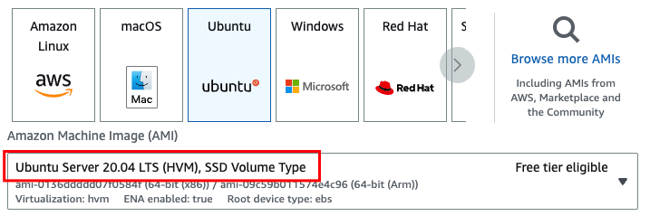

# CP-Ansible Playbooks

My [CP-Ansible](https://docs.confluent.io/ansible/current/overview.html) Playbooks

## What's currently available

There are playbooks (with instructions) for the following configurations:

- [One Zookeeper; one Broker](one-zk-one-broker/README.md)
- [One Zookeeper; one Broker; Confluent Control Center](one-zk-one-broker-c3/README.md)
- [All CP Components; no security configured](full-cluster-no-security/README.md)
- [One Zookeeper; one Broker; Confluent Control Center; TLS/SSL](one-zk-one-broker-c3-tls/README.md)

## Installation

Follow these steps to install CP-Ansible (Ubuntu):

```bash
pip3 install ansible
python3.11 -m pip install --upgrade pip
ansible-galaxy collection install git+https://github.com/confluentinc/cp-ansible.git
ansible-galaxy collection install community.general
```

## What instances should I use for my target machines?

These playbooks have been tested with the latest version of cp-ansible (7.4.0) and Ubuntu 20.04 on AWS:



## Useful reading

- https://docs.confluent.io/platform/current/installation/system-requirements.html#operating-systems