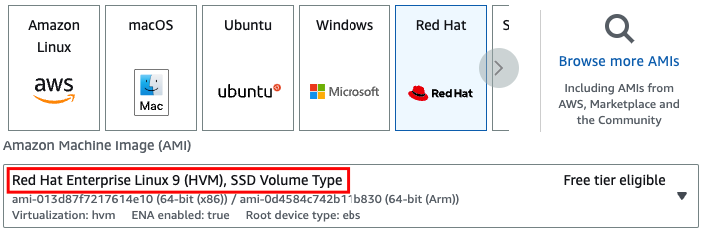

# CP-Ansible Playbooks

My [CP-Ansible](https://docs.confluent.io/ansible/current/overview.html) Playbooks

## What's currently available

There are playbooks (with instructions) for the following configurations:

- [One Zookeeper; one Broker](one-zk-one-broker/README.md)
- [One Zookeeper; one Broker; Confluent Control Center](one-zk-one-broker-c3/README.md)
- [All CP Components; no security configured](full-cluster-no-security/README.md)
- [One Zookeeper; one Broker; Confluent Control Center; TLS/SSL](one-zk-one-broker-c3-tls/README.md)

## Installation

### Linux

Follow these steps to install CP-Ansible (on Ubuntu):

```bash
ssh -i filenameofyour.pem ubuntu@ec2-xxx-xxx-xxx-xxx.aws-region.compute.amazonaws.com
pip3 install ansible
python3.11 -m pip install --upgrade pip
ansible-galaxy collection install git+https://github.com/confluentinc/cp-ansible.git
ansible-galaxy collection install ansible.posix
ansible-galaxy collection install community.general
```

For Redhat 9:

```bash
ssh -i  filenameofyour.pem ec2-user@ec2-xxx-xxx-xxx-xxx.aws-region.compute.amazonaws.com
# sudo yum install python3 - not necessary, I think?
sudo dnf install ansible-core
ansible-galaxy collection install git+https://github.com/confluentinc/cp-ansible.git
ansible-galaxy collection install ansible.posix
ansible-galaxy collection install community.general
```

### OS X

If you're planning on running CP-Ansible on OS X, follow these steps (using homebrew):

```bash
brew install python@3.11 # or python3
brew install ansible
ansible-galaxy collection install git+https://github.com/confluentinc/cp-ansible.git
ansible-galaxy collection install ansible.posix
ansible-galaxy collection install community.general
```

You may also need to run this after installing python3:

```bash
brew postinstall python3
```

## What instances should I use for my target machines?

These playbooks have been tested with the latest version of cp-ansible (7.4.0) and Ubuntu 20.04 on AWS:


Redhat 9 has been certified with Confluent Platform 7.4.x+ on AWS:



## Useful reading

- <https://docs.confluent.io/platform/current/installation/system-requirements.html#operating-systems>
- <https://ubuntu.com/server/docs/service-kerberos>
