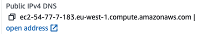

# One Zookeeper node; one broker; Kerberos

## Setting up the KDC instance

We're going to use the same machine that we used for the Ansible host to set up our KDC - it's already in the VPC and it's not being used much when cp-ansible is not running a deployment.

Install the Kerberos (`krb5`) dependencies on the machine that you plan to use for Kerberos Authorization.  Note that we're using a RHEL 9 instance for this work (prior examples used Ubuntu):

```bash
sudo dnf install -y krb5-server krb5-libs krb5-workstation
```

### Note for Ubuntu Users

If you wanted to set this up using Ubuntu, you would run:

```bash
sudo apt install krb5-kdc krb5-admin-server
```

And to check the service was set up correctly, run:

```bash
systemctl status krb5-kdc.service
```

To edit:

```bash
sudo vim /etc/krb5.conf
```

For Ubuntu, your krb5 config file should look like this:

```conf
[libdefaults]
        default_realm = AD.CONFLUENT.IO
        kdc_timesync = 1
        ccache_type = 4
        proxiable = true
        dns_lookup_realm = false
        dns_lookup_kdc = false
        ticket_lifetime = 24h
        renew_lifetime = 7d
        forwardable = true
        udp_preference_limit = 1
        default_tkt_enctypes = aes256-cts-hmac-sha1-96 aes128-cts-hmac-sha1-96 aes256-cts-hmac-sha384-192 aes128-cts-hmac-sha256-128
        default_tgs_enctypes = aes256-cts-hmac-sha1-96 aes128-cts-hmac-sha1-96 aes256-cts-hmac-sha384-192 aes128-cts-hmac-sha256-128
        permitted_enctypes   = aes256-cts-hmac-sha1-96 aes128-cts-hmac-sha1-96 aes256-cts-hmac-sha384-192 aes128-cts-hmac-sha256-128

        fcc-mit-ticketflags = true

[realms]
        AD.CONFLUENT.IO = {
                kdc = ec2-54-155-209-51.eu-west-1.compute.amazonaws.com:88
                admin_server = ec2-54-155-209-51.eu-west-1.compute.amazonaws.com:749
                default_domain = ad.confluent.io
        }

[domain_realm]
        .ad.confluent.io = AD.CONFLUENT.IO
        ad.confluent.io = AD.CONFLUENT.IO
```

Note that the service won't start yet; the next thing you need to do is initialise the database and set a password:

```bash
sudo kdb5_util create -s
```

You should see:

```bash
Loading random data
Initializing database '/var/lib/krb5kdc/principal' for realm 'AD.CONFLUENT.IO',
master key name 'K/M@AD.CONFLUENT.IO'
You will be prompted for the database Master Password.
It is important that you NOT FORGET this password.
Enter KDC database master key:
Re-enter KDC database master key to verify:
```

After doing all of the above, the service should now start as expected:

```bash
ubuntu@ip-10-0-0-64:~$ sudo systemctl restart krb5-kdc.service
ubuntu@ip-10-0-0-64:~$ systemctl status krb5-kdc.service
```

Quick sanity test with Ubuntu - first create a Principal:

```bash
sudo kadmin.local -q "add_principal -randkey kafka/ec2-52-211-77-186.eu-west-1.compute.amazonaws.com@AD.CONFLUENT.IO"
```

You should see:

```bash
Authenticating as principal root/admin@AD.CONFLUENT.IO with password.
WARNING: no policy specified for kafka/ec2-52-211-77-186.eu-west-1.compute.amazonaws.com@AD.CONFLUENT.IO; defaulting to no policy
Principal "kafka/ec2-52-211-77-186.eu-west-1.compute.amazonaws.com@AD.CONFLUENT.IO" created.
```

Create a Keytab:

```bash
sudo kadmin.local -q "xst -kt /tmp/kafka.service.keytab kafka/ec2-52-211-77-186.eu-west-1.compute.amazonaws.com@AD.CONFLUENT.IO"
```

You should see:

```bash
Authenticating as principal root/admin@AD.CONFLUENT.IO with password.
Entry for principal kafka/ec2-52-211-77-186.eu-west-1.compute.amazonaws.com@AD.CONFLUENT.IO with kvno 2, encryption type aes256-cts-hmac-sha1-96 added to keytab WRFILE:/tmp/kafka.service.keytab.
Entry for principal kafka/ec2-52-211-77-186.eu-west-1.compute.amazonaws.com@AD.CONFLUENT.IO with kvno 2, encryption type aes128-cts-hmac-sha1-96 added to keytab WRFILE:/tmp/kafka.service.keytab.
```

Now let's try to connect:

```bash
sudo kinit -kt /tmp/kafka.service.keytab kafka/ec2-52-211-77-186.eu-west-1.compute.amazonaws.com
```

Check with the KDC to ensure that the ticket has been issued:

```bash
sudo klist
```

You should see:

```bash
Ticket cache: FILE:/tmp/krb5cc_0
Default principal: kafka/ec2-52-211-77-186.eu-west-1.compute.amazonaws.com@AD.CONFLUENT.IO

Valid starting     Expires            Service principal
06/14/23 19:41:12  06/15/23 19:41:12  krbtgt/AD.CONFLUENT.IO@AD.CONFLUENT.IO
    renew until 06/14/23 19:41:12
```

### RHEL: Configuring krb5

Most other aspects of the remaining setup will be identical for either Ubuntu or Redhat (RHEL 9). We're going to focus on RHEL from now on.

Set up `krb5.conf`:

```bash
sudo dnf install vim
sudo vim /etc/krb5.conf
```

The `krb5.conf` file should look something like this:

```conf
# To opt out of the system crypto-policies configuration of krb5, remove the
# symlink at /etc/krb5.conf.d/crypto-policies which will not be recreated.
includedir /etc/krb5.conf.d/

[logging]
    default = FILE:/var/log/krb5libs.log
    kdc = FILE:/var/log/krb5kdc.log
    admin_server = FILE:/var/log/kadmind.log

[libdefaults]
    dns_lookup_realm = false
    dns_lookup_kdc = false
    ticket_lifetime = 24h
    renew_lifetime = 7d
    forwardable = true
    udp_preference_limit = 1
#    rdns = false
#    pkinit_anchors = FILE:/etc/pki/tls/certs/ca-bundle.crt
#    spake_preauth_groups = edwards25519
#    dns_canonicalize_hostname = fallback
#    qualify_shortname = ""
    default_realm = EXAMPLE.COM
#    default_ccache_name = KEYRING:persistent:%{uid}
    default_tkt_enctypes = aes256-cts-hmac-sha1-96 aes128-cts-hmac-sha1-96 aes256-cts-hmac-sha384-192 aes128-cts-hmac-sha256-128
    default_tgs_enctypes = aes256-cts-hmac-sha1-96 aes128-cts-hmac-sha1-96 aes256-cts-hmac-sha384-192 aes128-cts-hmac-sha256-128
    permitted_enctypes   = aes256-cts-hmac-sha1-96 aes128-cts-hmac-sha1-96 aes256-cts-hmac-sha384-192 aes128-cts-hmac-sha256-128


[realms]
 EXAMPLE.COM = {
     kdc = ec2-54-77-7-183.eu-west-1.compute.amazonaws.com:88
     admin_server = ec2-54-77-7-183.eu-west-1.compute.amazonaws.com:749
     default_domain = example.com
 }

[domain_realm]
    .example.com = EXAMPLE.COM
    example.com = EXAMPLE.COM
```

Note that the realm `kdc` and `admin_server` are the public DNS hostnames for the instance containing the `krb5-server`.

TODO - provide further details here

### Configure the Security Group for TCP Ports `88` and `749`

Note that we've configured two TCP ports in `krb5.conf`; these will need to be added to our Security Group to allow the instances to communicate:


### Set up the KDC

```bash
sudo kdb5_util create -s
```

This allows us to set up the database and set up a master key (password):

```bash
Initializing database '/var/kerberos/krb5kdc/principal' for realm 'EXAMPLE.COM',
master key name 'K/M@EXAMPLE.COM'
You will be prompted for the database Master Password.
It is important that you NOT FORGET this password.
Enter KDC database master key:
Re-enter KDC database master key to verify:
```

### Set up the Principal

First principal is `admin`:

```bash
kadmin.local -q "addprinc admin/admin"
```

This allows us to create the principal and to set a password for that principal:

```bash
Authenticating as principal root/admin@EXAMPLE.COM with password.
No policy specified for admin/admin@EXAMPLE.COM; defaulting to no policy
Enter password for principal "admin/admin@EXAMPLE.COM":
Re-enter password for principal "admin/admin@EXAMPLE.COM":
Principal "admin/admin@EXAMPLE.COM" created.
```

### Restart services

Not sure whether we need to - but we're doing it anyway...

```bash
sudo systemctl restart krb5kdc
sudo systemctl restart kadmin
```

Confirm the status of krb5 KDC is **running**:

```bash
sudo systemctl status krb5kdc
```

### Create User Principals

Let's create a `reader` Principal:

```bash
sudo kadmin.local -q "add_principal -randkey reader@EXAMPLE.COM"
```

You should see:

```bash
Authenticating as principal root/admin@EXAMPLE.COM with password.
No policy specified for reader@EXAMPLE.COM; defaulting to no policy
Principal "reader@EXAMPLE.COM" created.
```

Let's do the same for `writer`:

```bash
sudo kadmin.local -q "add_principal -randkey writer@EXAMPLE.COM"
Authenticating as principal root/admin@EXAMPLE.COM with password.
No policy specified for writer@EXAMPLE.COM; defaulting to no policy
Principal "writer@EXAMPLE.COM" created.
```

And `admin`:

```bash
sudo kadmin.local -q "add_principal -randkey admin@EXAMPLE.COM"
Authenticating as principal root/admin@EXAMPLE.COM with password.
No policy specified for admin@EXAMPLE.COM; defaulting to no policy
Principal "admin@EXAMPLE.COM" created.
```

### Create Service User Principals

Let's create principals for Zookeeper and the Kafka broker.  For a Service User, the format is slightly different; here the query follows this format: `add_principal -randkey kafka|zookeeper/<<AWS KAFKA/ZK HOST PUBLIC DNS NAME>>@EXAMPLE.COM`

Let's start with Zookeeper (note that the address is the public DNS for that instance):

```bash
sudo kadmin.local -q "add_principal -randkey zookeeper/ec2-52-16-120-59.eu-west-1.compute.amazonaws.com@EXAMPLE.COM"
```

You should see:

```bash
Authenticating as principal root/admin@EXAMPLE.COM with password.
No policy specified for zookeeper/ec2-52-16-120-59.eu-west-1.compute.amazonaws.com@EXAMPLE.COM; defaulting to no policy
Principal "zookeeper/ec2-52-16-120-59.eu-west-1.compute.amazonaws.com@EXAMPLE.COM" created.
```

And for the broker:

```bash
sudo kadmin.local -q "add_principal -randkey kafka/ec2-52-211-77-186.eu-west-1.compute.amazonaws.com@EXAMPLE.COM"
```

```bash
Authenticating as principal root/admin@EXAMPLE.COM with password.
No policy specified for kafka/ec2-52-211-77-186.eu-west-1.compute.amazonaws.com@EXAMPLE.COM; defaulting to no policy
Principal "kafka/ec2-52-211-77-186.eu-west-1.compute.amazonaws.com@EXAMPLE.COM" created.
```

### Create Keytabs

For each of the users and service users, we now need to export out `keytab` files for those users.

Note that the keytab file will be written to `/tmp` and the user is `kafka` and the host is the Public EC2 DNS hostname



```bash
sudo kadmin.local -q "xst -kt /tmp/kafka.service.keytab kafka/ec2-52-211-77-186.eu-west-1.compute.amazonaws.com@EXAMPLE.COM"
```

Let's do the same for Zookeeper:

```bash
sudo kadmin.local -q "xst -kt /tmp/zookeeper.service.keytab zookeeper/ec2-52-16-120-59.eu-west-1.compute.amazonaws.com@EXAMPLE.COM"
```

You'll see some output like this:

```bash
Authenticating as principal root/admin@EXAMPLE.COM with password.
Entry for principal kafka/ec2-52-211-77-186.eu-west-1.compute.amazonaws.com@EXAMPLE.COM with kvno 2, encryption type aes256-cts-hmac-sha384-192 added to keytab WRFILE:/tmp/kafka.service.keytab.
Entry for principal kafka/ec2-52-211-77-186.eu-west-1.compute.amazonaws.com@EXAMPLE.COM with kvno 2, encryption type aes128-cts-hmac-sha256-128 added to keytab WRFILE:/tmp/kafka.service.keytab.
Entry for principal kafka/ec2-52-211-77-186.eu-west-1.compute.amazonaws.com@EXAMPLE.COM with kvno 2, encryption type aes256-cts-hmac-sha1-96 added to keytab WRFILE:/tmp/kafka.service.keytab.
Entry for principal kafka/ec2-52-211-77-186.eu-west-1.compute.amazonaws.com@EXAMPLE.COM with kvno 2, encryption type aes128-cts-hmac-sha1-96 added to keytab WRFILE:/tmp/kafka.service.keytab.
Entry for principal kafka/ec2-52-211-77-186.eu-west-1.compute.amazonaws.com@EXAMPLE.COM with kvno 2, encryption type camellia256-cts-cmac added to keytab WRFILE:/tmp/kafka.service.keytab.
Entry for principal kafka/ec2-52-211-77-186.eu-west-1.compute.amazonaws.com@EXAMPLE.COM with kvno 2, encryption type camellia128-cts-cmac added to keytab WRFILE:/tmp/kafka.service.keytab.
Entry for principal kafka/ec2-52-211-77-186.eu-west-1.compute.amazonaws.com@EXAMPLE.COM with kvno 2, encryption type arcfour-hmac added to keytab WRFILE:/tmp/kafka.service.keytab.
```

Let's create the `reader`, `writer` and `admin` keytabs:

```bash
sudo kadmin.local -q "xst -kt /tmp/reader.user.keytab reader@EXAMPLE.COM"
sudo kadmin.local -q "xst -kt /tmp/writer.user.keytab writer@EXAMPLE.COM"
sudo kadmin.local -q "xst -kt /tmp/admin.user.keytab admin@EXAMPLE.COM"
```

You will see content like this for each keytab:

```bash
Authenticating as principal kafka/admin@EXAMPLE.COM with password.
Entry for principal admin@EXAMPLE.COM with kvno 2, encryption type aes256-cts-hmac-sha384-192 added to keytab WRFILE:/tmp/admin.user.keytab.
Entry for principal admin@EXAMPLE.COM with kvno 2, encryption type aes128-cts-hmac-sha256-128 added to keytab WRFILE:/tmp/admin.user.keytab.
Entry for principal admin@EXAMPLE.COM with kvno 2, encryption type aes256-cts-hmac-sha1-96 added to keytab WRFILE:/tmp/admin.user.keytab.
Entry for principal admin@EXAMPLE.COM with kvno 2, encryption type aes128-cts-hmac-sha1-96 added to keytab WRFILE:/tmp/admin.user.keytab.
Entry for principal admin@EXAMPLE.COM with kvno 2, encryption type camellia256-cts-cmac added to keytab WRFILE:/tmp/admin.user.keytab.
Entry for principal admin@EXAMPLE.COM with kvno 2, encryption type camellia128-cts-cmac added to keytab WRFILE:/tmp/admin.user.keytab.
Entry for principal admin@EXAMPLE.COM with kvno 2, encryption type arcfour-hmac added to keytab WRFILE:/tmp/admin.user.keytab.
```

After all of these have been created, you should now have 5 Keytab files in `tmp`:

```bash
-rw-------. 1 root root  463 Jun 14 19:07 admin.user.keytab
-rw-------. 1 root root 1638 Jun 14 15:25 kafka.service.keytab
-rw-------. 1 root root  470 Jun 14 19:07 reader.user.keytab
-rw-------. 1 root root  470 Jun 14 19:07 writer.user.keytab
-rw-------. 1 root root  841 Jun 14 15:49 zookeeper.service.keytab
```

## Testing the connection using the Keytab

Let's try to connect using the keytab and the Principal:

```bash
kinit -kt kafka.service.keytab kafka/ec2-52-211-77-186.eu-west-1.compute.amazonaws.com
```

Note that this fails - but what's key here is the "permission denied" exception:

```bash
kinit: Pre-authentication failed: Permission denied while getting initial credentials
```

Could it be that the user running has insufficient permissions on the host OS?  What happens if we test with `sudo`?:

```bash
sudo kinit -kt kafka.service.keytab kafka/ec2-52-211-77-186.eu-west-1.compute.amazonaws.com
```

Now we get returned to the prompt - no other information is provided.  Let's see whether the `kinit` call was successful by running `klist`:

```bash
sudo klist
```

We now see that we have a valid session:

```bash
Ticket cache: KCM:0
Default principal: kafka/ec2-52-211-77-186.eu-west-1.compute.amazonaws.com@EXAMPLE.COM

Valid starting       Expires              Service principal
06/14/2023 15:29:13  06/15/2023 15:29:13  krbtgt/EXAMPLE.COM@EXAMPLE.COM
    renew until 06/14/2023 15:29:13
```

Great! We're ready to start working on the Playbook!

## Getting Started

To get the playbook running, you'll need two EC2 instances:

- Broker (`t2.large`)
- Zookeeper (`t2.medium`)

### Modify the Playbook

Specify the PEM file that you used when the instance was created in the playbook (`hosts.yaml`):

```yaml
    ansible_ssh_private_key_file: <yourPEMfilename>.pem
```

Configure the Zookeeper host (use the internal host DNS name for the first line and the Public DNS host name for the second line):

```yaml
zookeeper:
  hosts:
    ip-xxx-xxx-xxx-xxx.aws-region.compute.internal:
      ansible_host: ec2-xxx-xxx-xxx-xxx.aws-region.compute.amazonaws.com
```

Configure the Broker (use the internal host DNS name for the first line and the Public DNS host name for the second line):

```yaml
kafka_broker:
  hosts:
    ip-xxx-xxx-xxx-xxx.aws-region.compute.internal:
      ansible_host: ec2-xxx-xxx-xxx-xxx.aws-region.compute.amazonaws.com
```

### Run Ansible

Before running the Playbook - on RHEL 9 you need to run the following before starting to deploy the playbook (otherwise you will see a "Failed to validate GPG signature" message as soon as ansible attempts to install packages):

```bash
sudo update-crypto-policies --set DEFAULT:SHA1
sudo echo "%_pkgverify_level signature" > /etc/rpm/macros.verify
sudo reboot
```

Run the playbook:

```bash
ansible-playbook -i hosts.yaml confluent.platform.all
```

When the playbook has finished running, you'll see something like this:

```bash
PLAY RECAP *********************************************************************
ip-10-0-15-151.eu-west-1.compute.internal : ok=63   changed=27   unreachable=0    failed=0    skipped=51   rescued=0    ignored=0
ip-10-0-7-82.eu-west-1.compute.internal : ok=55   changed=22   unreachable=0    failed=0    skipped=41   rescued=0    ignored=0
```

### Testing the output

Let's start with Zookeeper:

```bash
zookeeper-shell localhost:2181
ls /
ls /brokers
ls /brokers/ids
```

This indicates that Zookeeper is running and a broker has been registered.

Let's check the broker:

```bash
kafka-topics --bootstrap-server localhost:9091 --list
kafka-topics --bootstrap-server localhost:9091 --under-replicated-partitions --describe
```

Create a topic:

```bash
kafka-topics --bootstrap-server localhost:9091 --create --topic test-topic --replication-factor 1 --partitions 1
```

Produce to the topic:

```bash
kafka-console-producer --bootstrap-server localhost:9091 --topic test-topic
```

Consume from the topic:

```bash
kafka-console-consumer --bootstrap-server localhost:9091 --topic test-topic --from-beginning
```
