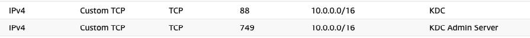

# One Zookeeper node; one broker; Kerberos

## Getting Started

To get the playbook running, you'll need two EC2 instances:

- Broker (`t2.large`)
- Zookeeper (`t2.medium`)

We are also working on the premise that you have a standalone instance in your VPC that you are using to run cp-ansible; if so, this can be used as your KDC (Key Distribution Center).  If you don't have an instance available for this, just spin up another `t2.medium` instance and use that for your KDC.

## Setting up the KDC instance

We're going to use the same machine that we used for the Ansible host to set up our KDC - it's already in the VPC and it's not being used much when cp-ansible is not running a deployment.

Install the Kerberos (`krb5`) dependencies on the machine that you plan to use for Kerberos Authorization:

```bash
sudo apt install krb5-kdc krb5-admin-server
```

And to check the service was set up correctly, run:

```bash
systemctl status krb5-kdc.service
```

Most likely the service has reported a failure to start; we need to do some more configuration before it will start suceessfully.

Firstly, we need to edit the `krb5.conf` file to set everything up properly:

```bash
sudo vim /etc/krb5.conf
```

Your krb5 config file should look like this:

```conf
[libdefaults]
        default_realm = AD.CONFLUENT.IO
        kdc_timesync = 1
        ccache_type = 4
        proxiable = true

        dns_lookup_realm = false
        dns_lookup_kdc = false
        ticket_lifetime = 24h
        renew_lifetime = 7d
        forwardable = true
        udp_preference_limit = 1
        default_tkt_enctypes = aes256-cts-hmac-sha1-96 aes128-cts-hmac-sha1-96 aes256-cts-hmac-sha384-192 aes128-cts-hmac-sha256-128
        default_tgs_enctypes = aes256-cts-hmac-sha1-96 aes128-cts-hmac-sha1-96 aes256-cts-hmac-sha384-192 aes128-cts-hmac-sha256-128
        permitted_enctypes   = aes256-cts-hmac-sha1-96 aes128-cts-hmac-sha1-96 aes256-cts-hmac-sha384-192 aes128-cts-hmac-sha256-128

        fcc-mit-ticketflags = true

[realms]
        AD.CONFLUENT.IO = {
                kdc = ec2-54-155-209-51.eu-west-1.compute.amazonaws.com:88
                admin_server = ec2-54-155-209-51.eu-west-1.compute.amazonaws.com:749
                default_domain = ad.confluent.io
        }

[domain_realm]
        .ad.confluent.io = AD.CONFLUENT.IO
        ad.confluent.io = AD.CONFLUENT.IO
```

Note that the realm `kdc` and `admin_server` DNS names are the **public DNS hostname** for the instance containing the `krb5-server`.

Note that even after modifying `/etc/krb5.conf` the service won't start yet; the next thing you need to do is initialise the database and set a password; let's do that next.

### Set up the KDC

To do this, you can run:

```bash
sudo kdb5_util create -s
```

This allows us to set up the database and set up a master key (password).
You should see:

```bash
Loading random data
Initializing database '/var/lib/krb5kdc/principal' for realm 'AD.CONFLUENT.IO',
master key name 'K/M@AD.CONFLUENT.IO'
You will be prompted for the database Master Password.
It is important that you NOT FORGET this password.
Enter KDC database master key:
Re-enter KDC database master key to verify:
```

After doing all of the above, the service should now start as expected:

```bash
sudo systemctl restart krb5-kdc.service
systemctl status krb5-kdc.service
```

### Configure the Security Group for TCP Ports `88` and `749`

Note that we've configured two TCP ports in `krb5.conf`; these will need to be added to our Security Group to allow the instances to communicate:



That's it! The KDC is now ready to use.

## Setting up the Principals

We need to set up two types of Principal: one which governs roles and another which will be used to manage the services.

### Set up the non-service Principals

First principal is `admin`:

```bash
sudo kadmin.local -q "addprinc admin/admin"
```

You will be prompted to enter a password (and to confirm the password). You should see:

```bash
Authenticating as principal root/admin@AD.CONFLUENT.IO with password.
WARNING: no policy specified for admin/admin@AD.CONFLUENT.IO; defaulting to no policy
Enter password for principal "admin/admin@AD.CONFLUENT.IO":
Re-enter password for principal "admin/admin@AD.CONFLUENT.IO":
Principal "admin/admin@AD.CONFLUENT.IO" created.
```

We're going to restart the service after creating this one, just for good measure:

```bash
sudo systemctl restart krb5-kdc.service
```

### Create User Principals

Let's create a `reader` Principal:

```bash
sudo kadmin.local -q "add_principal -randkey reader@AD.CONFLUENT.IO"
```

Let's do the same for `writer`:

```bash
sudo kadmin.local -q "add_principal -randkey writer@AD.CONFLUENT.IO"
```

And finally, `admin`:

```bash
sudo kadmin.local -q "add_principal -randkey admin@AD.CONFLUENT.IO"
```

### Create Service User Principals

Now let's create principals for Zookeeper and the Kafka broker.  For a Service User, the format is slightly different; here the query follows this format: `add_principal -randkey kafka|zookeeper/<<AWS KAFKA/ZK HOST PRIVATE DNS NAME>>@AD.CONFLUENT.IO`

Let's start with Zookeeper (note that the address is the **Private DNS** [.internal] for that instance):


```bash
sudo kadmin.local -q "add_principal -randkey zookeeper/ip-10-0-11-190.eu-west-1.compute.internal@AD.CONFLUENT.IO"
```

And let's create a principal for our Kafka broker:

```bash
sudo kadmin.local -q "add_principal -randkey kafka/ip-10-0-10-18.eu-west-1.compute.internal@AD.CONFLUENT.IO"
```

So, in summary, we now have 5 Principals: 3 are for our users (reader, writer and admin) and we have 2 service Principals for our 2 components (Zookeeper and Kafka).

### Create Keytabs

For each of the users and service users, we now need to export out `keytab` files for those users.

Note that the keytab file will be written to `/tmp`.

Reminder that for the Service Principals, the EC2 host given is the **Private DNS** [.internal] hostname for the target machine (either the zookeeper instance or the broker instance).

Starting with the Broker:

```bash
sudo kadmin.local -q "xst -kt /tmp/kafka.service.keytab kafka/ip-10-0-10-18.eu-west-1.compute.internal@AD.CONFLUENT.IO"
```

Let's do the same for Zookeeper:

```bash
sudo kadmin.local -q "xst -kt /tmp/zookeeper.service.keytab zookeeper/ip-10-0-11-190.eu-west-1.compute.internal@AD.CONFLUENT.IO"
```

Let's create the `reader`, `writer` and `admin` keytabs:

```bash
sudo kadmin.local -q "xst -kt /tmp/reader.user.keytab reader@AD.CONFLUENT.IO"
sudo kadmin.local -q "xst -kt /tmp/writer.user.keytab writer@AD.CONFLUENT.IO"
sudo kadmin.local -q "xst -kt /tmp/admin.user.keytab admin@AD.CONFLUENT.IO"
```

After all of these have been created, you should now have 5 Keytab files in `tmp`:

```bash
-rw-------. 1 root root  463 Jun 14 19:07 admin.user.keytab
-rw-------. 1 root root 1638 Jun 14 15:25 kafka.service.keytab
-rw-------. 1 root root  470 Jun 14 19:07 reader.user.keytab
-rw-------. 1 root root  470 Jun 14 19:07 writer.user.keytab
-rw-------. 1 root root  841 Jun 14 15:49 zookeeper.service.keytab
```

## Testing the connection using the Keytab

Let's try to connect using the `kafka` keytab and the Principal:

```bash
sudo kinit -kt kafka.service.keytab kafka/ec2-3-252-36-160.eu-west-1.compute.amazonaws.com
```

Now we get returned to the prompt - no other information is provided.  Let's see whether the `kinit` call was successful by running `klist`:

```bash
sudo klist
```

We now see that we have a valid session:

```bash
Ticket cache: KCM:0
Default principal: kafka/ec2-52-211-77-186.eu-west-1.compute.amazonaws.com@EXAMPLE.COM

Valid starting       Expires              Service principal
06/14/2023 15:29:13  06/15/2023 15:29:13  krbtgt/EXAMPLE.COM@EXAMPLE.COM
    renew until 06/14/2023 15:29:13
```

Great! We're ready to start working on the Playbook!

### Modify the Playbook

Specify the PEM file that you used when the instance was created in the playbook (`hosts.yaml`):

```yaml
    ansible_ssh_private_key_file: <yourPEMfilename>.pem
```

Configure the Zookeeper host (use the internal host DNS name for the first line and the Public DNS host name for the second line):

```yaml
zookeeper:
  hosts:
    ip-xxx-xxx-xxx-xxx.aws-region.compute.internal:
      ansible_host: ec2-xxx-xxx-xxx-xxx.aws-region.compute.amazonaws.com
```

Configure the Broker (use the internal host DNS name for the first line and the Public DNS host name for the second line):

```yaml
kafka_broker:
  hosts:
    ip-xxx-xxx-xxx-xxx.aws-region.compute.internal:
      ansible_host: ec2-xxx-xxx-xxx-xxx.aws-region.compute.amazonaws.com
```

### Run Ansible

Run the playbook:

```bash
ansible-playbook -i hosts.yaml confluent.platform.all
```

Note: when Keytab files are created, they have very limited permissions; you may encounter an issue where the keytab is unreadable by Ansible.  In which case, open out the permissions for the Keytabs and re-run the playbook:

```bash
sudo chmod 755 *.keytab
```

When the playbook has finished running, you'll see something like this:

```bash
PLAY RECAP ************************************************************************************************************************************
ip-10-0-10-18.eu-west-1.compute.internal : ok=65   changed=0    unreachable=0    failed=0    skipped=49   rescued=0    ignored=0
ip-10-0-11-190.eu-west-1.compute.internal : ok=57   changed=0    unreachable=0    failed=0    skipped=39   rescued=0    ignored=0
```

### Testing the Client application

SSH to the Kafka Broker.

```bash
sudo apt install krb5-user
```

Run `kinit`:

```bash
sudo kinit -kt /etc/security/keytabs/kafka_broker.keytab kafka/ip-10-0-10-18.eu-west-1.compute.internal@AD.CONFLUENT.IO
```

```bash
sudo kvno -k /etc/security/keytabs/kafka_broker.keytab kafka/ip-10-0-10-18.eu-west-1.compute.internal@AD.CONFLUENT.IO
```

Edit a jaas file:

```bash
vim client.jaas 
```

This file will contain:

```jaas
KafkaClient {
        com.sun.security.auth.module.Krb5LoginModule required \
        useKeyTab=true \
        storeKey=true \
        keyTab="/etc/security/keytabs/kafka_broker.keytab" \
        principal="kafka/ip-10-0-10-18.eu-west-1.compute.internal@AD.CONFLUENT.IO";
};
```

Then:

```bash
vim client.properties
```

This file will contain:

```properties
sasl.mechanism=GSSAPI
security.protocol=SASL_PLAINTEXT
sasl.kerberos.service.name=kafka
sasl.jaas.config=com.sun.security.auth.module.Krb5LoginModule required \
useKeyTab=true \
storeKey=true \
keyTab="/etc/security/keytabs/kafka_broker.keytab" \
principal="kafka/ip-10-0-10-18.eu-west-1.compute.internal@AD.CONFLUENT.IO";
```

Then:

```bash
export KAFKA_OPTS="-Djava.security.auth.login.config=~/client.jaas"
```

And produce:

```bash
sudo kafka-console-producer --bootstrap-server ip-10-0-10-18.eu-west-1.compute.internal:9091 --topic test1 --producer.config ~/client.properties
```

### Testing the output

Let's start with Zookeeper:

```bash
zookeeper-shell localhost:2181
ls /
ls /brokers
ls /brokers/ids
```

This indicates that Zookeeper is running and a broker has been registered.

Let's check the broker:

```bash
kafka-topics --bootstrap-server localhost:9091 --list
kafka-topics --bootstrap-server localhost:9091 --under-replicated-partitions --describe
```

Create a topic:

```bash
kafka-topics --bootstrap-server localhost:9091 --create --topic test-topic --replication-factor 1 --partitions 1
```

Produce to the topic:

```bash
kafka-console-producer --bootstrap-server localhost:9091 --topic test-topic
```

Consume from the topic:

```bash
kafka-console-consumer --bootstrap-server localhost:9091 --topic test-topic --from-beginning
```
