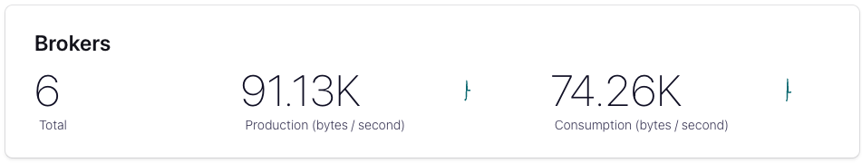
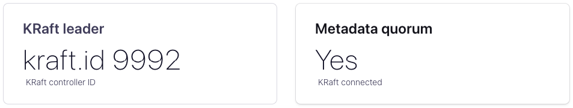

# Three KRaft nodes; three brokers; Confluent Control Center (C3) and TLS (SSL)

## Introduction

Note that TLS/SSL can be configured by adding a single line to your playbook:

```yaml
  vars:
    ssl_enabled: true
```

## Prerequisites

To get the playbook running, you'll need eight EC2 instances:

- C3 (`t2.large`)
- Broker (`t2.large`)
- KRaft Controller (`t2.medium`)
- Schema Registry (`t2.medium`)
  
## Modify the Playbook

Specify the PEM file that you used (to connect to the instance) when the instance was created in the playbook (`hosts.yaml`):

```yaml
    ansible_ssh_private_key_file: <yourPEMfilename>.pem
```

Configure the three KRaft Quorum Controllers (`kafka_controller`) - use the internal host DNS name for the first line and the Public DNS host name for the second line:

```yaml
kafka_controller:
  hosts:
    ip-xxx-xxx-xxx-xxx.aws-region.compute.internal:
      ansible_host: ec2-xxx-xxx-xxx-xxx.aws-region.compute.amazonaws.com
    ip-xxx-xxx-xxx-xxx.aws-region.compute.internal:
      ansible_host: ec2-xxx-xxx-xxx-xxx.aws-region.compute.amazonaws.com
    ip-xxx-xxx-xxx-xxx.aws-region.compute.internal:
      ansible_host: ec2-xxx-xxx-xxx-xxx.aws-region.compute.amazonaws.com
```

Configure the three Brokers (use the internal host DNS name for the first line and the Public DNS host name for the second line):

```yaml
kafka_broker:
  hosts:
    ip-xxx-xxx-xxx-xxx.aws-region.compute.internal:
      ansible_host: ec2-xxx-xxx-xxx-xxx.aws-region.compute.amazonaws.com
    ip-xxx-xxx-xxx-xxx.aws-region.compute.internal:
      ansible_host: ec2-xxx-xxx-xxx-xxx.aws-region.compute.amazonaws.com
    ip-xxx-xxx-xxx-xxx.aws-region.compute.internal:
      ansible_host: ec2-xxx-xxx-xxx-xxx.aws-region.compute.amazonaws.com
```

Configure the C3 host (use the internal host DNS name for the first line and the Public DNS host name for the second line):

```yaml
control_center:
  hosts:
    ip-xxx-xxx-xxx-xxx.aws-region.compute.internal:
      ansible_host: ec2-xxx-xxx-xxx-xxx.aws-region.compute.amazonaws.com
```

Configure the Schema Registry host (use the internal host DNS name for the first line and the Public DNS host name for the second line):

```yaml
schema_registry:
  hosts:
    ip-xxx-xxx-xxx-xxx.aws-region.compute.internal:
      ansible_host: ec2-xxx-xxx-xxx-xxx.aws-region.compute.amazonaws.com
```

### Run Ansible

Run the playbook:

```bash
ansible-playbook -i hosts.yaml confluent.platform.all
```

When the playbook has finished running, you'll see something like this:

```bash
PLAY RECAP ******************************************************************************************************************************************************
ip-10-0-0-149.eu-west-1.compute.internal : ok=94   changed=21   unreachable=0    failed=0    skipped=56   rescued=0    ignored=0
ip-10-0-12-71.eu-west-1.compute.internal : ok=110  changed=26   unreachable=0    failed=0    skipped=50   rescued=0    ignored=0
ip-10-0-13-195.eu-west-1.compute.internal : ok=94   changed=21   unreachable=0    failed=0    skipped=56   rescued=0    ignored=0
ip-10-0-14-129.eu-west-1.compute.internal : ok=94   changed=21   unreachable=0    failed=0    skipped=60   rescued=0    ignored=0
ip-10-0-2-251.eu-west-1.compute.internal : ok=96   changed=21   unreachable=0    failed=0    skipped=47   rescued=0    ignored=0
ip-10-0-3-222.eu-west-1.compute.internal : ok=84   changed=19   unreachable=0    failed=0    skipped=51   rescued=0    ignored=0
ip-10-0-4-219.eu-west-1.compute.internal : ok=96   changed=21   unreachable=0    failed=0    skipped=47   rescued=0    ignored=0
ip-10-0-7-139.eu-west-1.compute.internal : ok=81   changed=38   unreachable=0    failed=0    skipped=53   rescued=0    ignored=0
```

## Confirm that the cluster is using KRaft mode

If we connect to one of the Kafka brokers, we can grep for messages about quorum by running:

```bash
grep Raft server.log
```

You should see messages logged by `RaftManager` and `KafkaRaftServer`:

```log
[2023-06-15 09:43:38,532] INFO [RaftManager nodeId=1] Completed transition to Unattached(epoch=0, voters=[9991, 9992, 9993], electionTimeoutMs=1415) (org.apache.kafka.raft.QuorumState)
[2023-06-15 09:43:38,535] INFO [kafka-raft-outbound-request-thread]: Starting (kafka.raft.RaftSendThread)
[2023-06-15 09:43:38,544] INFO [kafka-raft-io-thread]: Starting (kafka.raft.KafkaRaftManager$RaftIoThread)
[2023-06-15 09:43:38,734] INFO [RaftManager nodeId=1] Completed transition to FollowerState(fetchTimeoutMs=2000, epoch=86, leaderId=9992, voters=[9991, 9992, 9993], highWatermark=Optional.empty, fetchingSnapshot=Optional.empty) (org.apache.kafka.raft.QuorumState)
[2023-06-15 09:43:38,831] INFO [RaftManager nodeId=1] High watermark set to Optional[LogOffsetMetadata(offset=551, metadata=Optional.empty)] for the first time for epoch 86 (org.apache.kafka.raft.FollowerState)
[2023-06-15 09:43:40,595] INFO [RaftManager nodeId=1] Registered the listener kafka.server.metadata.BrokerMetadataListener@1031726463 (org.apache.kafka.raft.KafkaRaftClient)
[2023-06-15 09:43:46,471] INFO [KafkaRaftServer nodeId=1] Kafka Server started (kafka.server.KafkaRaftServer)
```

And in the configuration reported in `server.log`:

```log
    controller.quorum.voters = [9991@ip-10-0-12-71.eu-west-1.compute.internal:9093, 9992@ip-10-0-4-219.eu-west-1.compute.internal:9093, 9993@ip-10-0-2-251.eu-west-1.compute.internal:9093]
```

If we connect to one of the controllers, look in `/var/log/controller` for `controller.log` for evidence that the three brokers have been registered with the Quorum Controllers:

```log
[2023-06-15 09:43:41,092] INFO [Controller 9991] Registered new broker: RegisterBrokerRecord(brokerId=1, isMigratingZkBroker=false, incarnation
Id=PU2-jSusTtiCnPMbuNkGsw, brokerEpoch=555, endPoints=[BrokerEndpoint(name='INTERNAL', host='ip-10-0-14-129.eu-west-1.compute.internal', port=9
092, securityProtocol=0), BrokerEndpoint(name='BROKER', host='ip-10-0-14-129.eu-west-1.compute.internal', port=9091, securityProtocol=0)], feat
ures=[BrokerFeature(name='confluent.metadata.version', minSupportedVersion=1, maxSupportedVersion=108), BrokerFeature(name='metadata.version',
minSupportedVersion=1, maxSupportedVersion=8)], rack=null, fenced=true, inControlledShutdown=false) (org.apache.kafka.controller.ClusterControl
Manager)
[2023-06-15 09:43:41,092] INFO [Controller 9991] Registered new broker: RegisterBrokerRecord(brokerId=3, isMigratingZkBroker=false, incarnation
Id=TBTJydJWRXKRCNXtGH-eew, brokerEpoch=556, endPoints=[BrokerEndpoint(name='INTERNAL', host='ip-10-0-13-195.eu-west-1.compute.internal', port=9
092, securityProtocol=0), BrokerEndpoint(name='BROKER', host='ip-10-0-13-195.eu-west-1.compute.internal', port=9091, securityProtocol=0)], feat
ures=[BrokerFeature(name='confluent.metadata.version', minSupportedVersion=1, maxSupportedVersion=108), BrokerFeature(name='metadata.version',
minSupportedVersion=1, maxSupportedVersion=8)], rack=null, fenced=true, inControlledShutdown=false) (org.apache.kafka.controller.ClusterControl
Manager)
[2023-06-15 09:43:41,591] INFO [Controller 9991] Registered new broker: RegisterBrokerRecord(brokerId=2, isMigratingZkBroker=false, incarnation
Id=wZeHi16sSEagVvZpvd9JUA, brokerEpoch=560, endPoints=[BrokerEndpoint(name='INTERNAL', host='ip-10-0-0-149.eu-west-1.compute.internal', port=90
92, securityProtocol=0), BrokerEndpoint(name='BROKER', host='ip-10-0-0-149.eu-west-1.compute.internal', port=9091, securityProtocol=0)], featur
es=[BrokerFeature(name='confluent.metadata.version', minSupportedVersion=1, maxSupportedVersion=108), BrokerFeature(name='metadata.version', mi
nSupportedVersion=1, maxSupportedVersion=8)], rack=null, fenced=true, inControlledShutdown=false) (org.apache.kafka.controller.ClusterControlMa
nager)
```

We can visit Confluent Control Center on port `9021` (over https):

<https://ec2-3-249-62-113.eu-west-1.compute.amazonaws.com:9021/>

(Note that it will complain about the TLS certificate - so you'll need to allow the browser connection in spite of this)

And we should be able to see evidence that the cluster is running in KRaft mode:




### TLS checks

We will start by installing `jq`:

```bash
sudo apt install jq
```

Our `snakeoil` CA certificate is generated by Ansible and it's stored in: `~/.ansible/collections/ansible_collections/confluent/platform/playbooks/generated_ssl_files`

Let's start by exporting the CA bundle for cURL:

```bash
export CURL_CA_BUNDLE=~/.ansible/collections/ansible_collections/confluent/platform/playbooks/generated_ssl_files/snakeoil-ca-1.crt
```

From here you can run:

```bash
curl -X GET https://ip-10-0-7-139.eu-west-1.compute.internal:8081/schemas/types | jq
```

This should return:

```json
[
  "JSON",
  "PROTOBUF",
  "AVRO"
]
```

If you don't want to set the `CURL_CA_BUNDLE` variable, you can pass the path in using `--cacert`:

```bash
curl --cacert ~/.ansible/collections/ansible_collections/confluent/platform/playbooks/generated_ssl_files/snakeoil-ca-1.crt -X GET https://ip-10-0-7-139.eu-west-1.compute.internal:8081/schemas/types | jq
```

### TLS Producer / Consumer

For this section, you will need a Java runtime to be installed on the host instance:

```bash
sudo apt install openjdk-17-jre-headless
```

Let's create a keystore and truststore for a client application using the CA created by Ansible - note that cp-ansible creates generates a standard password if you don't overridde it specifically, see:

https://github.com/confluentinc/cp-ansible/blob/7.4.0-post/roles/variables/defaults/main.yml#L220

In the following steps, we will use the cp-ansible provided CA and key (`snakeoil-ca-1.crt` and `snakeoil-ca-1.key`) and we will create a keystore and truststore for our client application to use to connect to the brokers:

```bash
keytool -keystore kafka.client.truststore.jks -alias CARoot -import -file ~/.ansible/collections/ansible_collections/confluent/platform/playbooks/generated_ssl_files/snakeoil-ca-1.crt -storepass confluent -keypass confluent -noprompt -keyalg RSA

keytool -genkey -keystore kafka.client.keystore.jks -validity 365 -storepass confluent -keypass confluent -dname "CN=ip-10-0-3-22.eu-west-1.compute.internal" -alias my-local-pc -storetype pkcs12 -keyalg RSA

keytool -keystore kafka.client.keystore.jks -certreq -file client-cert-sign-request -alias my-local-pc -storepass confluent -keypass confluent

openssl x509 -req -CA ~/.ansible/collections/ansible_collections/confluent/platform/playbooks/generated_ssl_files/snakeoil-ca-1.crt -CAkey ~/.ansible/collections/ansible_collections/confluent/platform/playbooks/generated_ssl_files/snakeoil-ca-1.key -in client-cert-sign-request -out client-cert-signed -days 365 -CAcreateserial -passin pass:capassword123

keytool -keystore kafka.client.keystore.jks -alias CARoot -import -file ~/.ansible/collections/ansible_collections/confluent/platform/playbooks/generated_ssl_files/snakeoil-ca-1.crt -storepass confluent -keypass confluent -noprompt

keytool -keystore kafka.client.keystore.jks -import -file client-cert-signed -alias my-local-pc -storepass confluent -keypass confluent -noprompt
```

With those files created, we now need to create the producer configuration for TLS - in this case, the file is named `client-tls.properties`:

```bash
security.protocol=SSL
ssl.truststore.location=/home/ubuntu/client/kafka.client.truststore.jks
ssl.truststore.password=confluent
ssl.keystore.location=/home/ubuntu/client/kafka.client.keystore.jks
ssl.keystore.password=confluent
ssl.key.password=confluent
```

### Produce using TLS

Let's produce some data:

```bash
./kafka-console-producer.sh --bootstrap-server ip-10-0-14-129.eu-west-1.compute.internal:9091 --topic kafka-topic --producer.config ~/client/client-tls.properties
```

### Consume using TLS

And let's now confirm that we can read it:

```bash
./kafka-console-consumer.sh --bootstrap-server ip-10-0-14-129.eu-west-1.compute.internal:9091 --topic kafka-topic --consumer.config ~/client/client-tls.properties --from-beginning
```

For the `console` tools (if they're unavailable on your host):

```bash
wget https://downloads.apache.org/kafka/3.5.0/kafka_2.12-3.5.0.tgz
tar -xvzf kafka_2.12-3.5.0.tgz
cd kafka_2.12-3.5.0/bin
```

TODO - log in to MDS (when we have a playbook for it):

```bash
confluent login --url https://localhost:8091  --ca-cert-path ./scripts/security/snakeoil-ca-1.crt
```